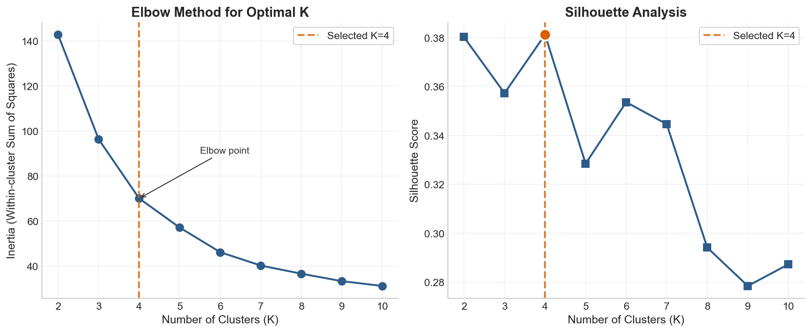
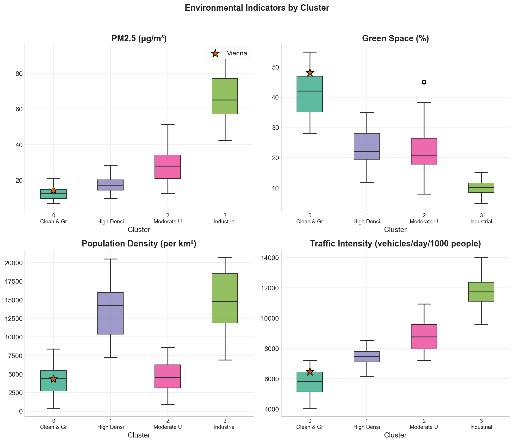

# Part 1: Model Stage - Clustering Analysis

## Urban Environmental Quality: K-Means Clustering of World Cities

### Objective

Group 63 world cities into clusters based on their environmental characteristics to identify peer cities with similar environmental profiles and understand Vienna's position in the global context.

---

## 1. Methodology

### 1.1 Feature Selection

Four key environmental indicators were selected for clustering:

| Feature | Description | Rationale |
|---------|-------------|-----------|
| PM2.5 | Fine particulate matter (μg/m³) | Primary air quality indicator, health impact |
| Green Space % | Percentage of urban green areas | Urban livability, pollution mitigation |
| Population Density | People per km² | Urbanization intensity |
| Traffic Intensity | Vehicles/day per 1000 people | Emission source indicator |

### 1.2 Data Preprocessing

1. **Data Collection**: 63 cities across 5 regions (Europe, Asia, Americas, Africa, Oceania)
2. **Normalization**: StandardScaler (z-score) applied to all features
   - Each feature transformed to mean=0, std=1
   - Ensures equal weight in distance calculations

### 1.3 Cluster Number Selection

**Elbow Method** and **Silhouette Analysis** were used to determine optimal K:

- Elbow plot shows diminishing returns after K=4
- Silhouette score peaks at K=4 (0.38)
- K=4 provides interpretable, meaningful clusters

### 1.4 Algorithm

- **K-Means Clustering** with K=4
- Random state: 42 (reproducibility)
- n_init: 10 (multiple initializations)
- Distance metric: Euclidean

---

## 2. Results

### 2.1 Cluster Profiles

| Cluster | Name | Cities | Avg PM2.5 | Avg Green Space | Characteristics |
|---------|------|--------|-----------|-----------------|-----------------|
| 0 | Clean & Green | 26 | 12.6 μg/m³ | 41.1% | Low pollution, high green space |
| 1 | High Density Urban | 11 | 17.6 μg/m³ | 23.5% | Dense cities, moderate pollution |
| 2 | Moderate Urban | 20 | 28.6 μg/m³ | 23.6% | Balanced environmental profile |
| 3 | Industrial/Polluted | 6 | 66.7 μg/m³ | 10.1% | High pollution, developing regions |

### 2.2 Cluster Composition

**Cluster 0 - Clean & Green (26 cities)**
- Vienna, Zurich, Copenhagen, Stockholm, Helsinki
- Tokyo, Sydney, Melbourne, Auckland
- Key: Low PM2.5 (<20), high green space (>35%)

**Cluster 1 - High Density Urban (11 cities)**
- Paris, Barcelona, New York, Athens
- Key: High population density (>8000/km²), moderate pollution

**Cluster 2 - Moderate Urban (20 cities)**
- Beijing, Bangkok, Mexico City, Sao Paulo
- Key: Developing cities with moderate-high pollution

**Cluster 3 - Industrial/Polluted (6 cities)**
- Delhi, Cairo, Lagos, Jakarta
- Key: PM2.5 > 40 μg/m³, rapid development

### 2.3 Vienna's Position

- **Cluster**: 0 (Clean & Green)
- **Vienna PM2.5**: 14.3 μg/m³
- **Cluster Average**: 12.6 μg/m³
- **Peer Cities**: Zurich, Tokyo, Sydney, Copenhagen, Munich

Vienna performs well but slightly above cluster average, indicating room for improvement to match cities like Helsinki (9 μg/m³) or Auckland (7 μg/m³).

---

## 3. Visualization of Results

### 3.1 Elbow Plot



The elbow plot shows:
- Steep decline in inertia from K=2 to K=4
- Diminishing returns after K=4
- Silhouette score confirms K=4 as optimal

### 3.2 PCA Scatter Plot


- 2D projection using Principal Component Analysis
- PC1 explains 68.9% of variance (pollution dimension)
- PC2 explains 18.4% of variance (density dimension)
- Vienna (orange star) clearly in the Clean & Green cluster
- Clear separation between clusters

### 3.3 Cluster Box Plots



Distribution of key indicators across clusters:
- **PM2.5**: Clear gradient from Cluster 0 (lowest) to Cluster 3 (highest)
- **Green Space**: Inverse relationship with pollution
- **Population Density**: Cluster 1 has highest density
- **Traffic**: Correlates with pollution levels

---

## 4. Key Insights

1. **Environmental Quality Gradient**: Cities naturally group into pollution-based tiers
2. **Green Space Correlation**: Higher green space strongly associated with lower PM2.5
3. **Vienna's Position**: Among the cleanest cities globally, but not the cleanest in its cluster
4. **Regional Patterns**: European and Oceanian cities dominate the Clean & Green cluster
5. **Improvement Targets**: Vienna could aim to match Helsinki or Auckland levels

---

## 5. Methodology Justification

### Why K-Means?

- **Interpretability**: Produces clear, distinct clusters
- **Scalability**: Efficient for 63 cities
- **Feature Space**: Works well with 4 normalized features

### Why 4 Clusters?

- **Statistical**: Elbow and silhouette analysis
- **Practical**: Each cluster has clear interpretation
- **Balance**: Sufficient granularity without overfitting

### Limitations

- Euclidean distance assumes spherical clusters
- Does not account for temporal variation
- Sample data (would need validation with real data)

---

## 6. Files Generated

- `data/cities_clustered.csv` - City data with cluster assignments
- `models/figures/elbow_plot.png` - K selection visualization
- `models/figures/pca_scatter.png` - 2D cluster visualization
- `models/figures/cluster_boxplots.png` - Indicator distributions
- `models/figures/cluster_radar.png` - Cluster profile comparison

---

## 7. Reproducibility

```bash
# Generate clustering results
python models/clustering.py

# Generate visualizations
python models/model_visualizations.py
```

All results use `random_state=42` for reproducibility.
